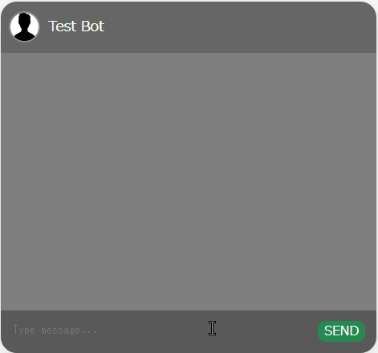

# yomura-dash-components
## Demo
### Chat



## Install

```shell
pip install git+https://github.com/yomura-yomura/yomura-dash-components
```

## QuickStart
### Chat
```python
import time

import dash
from dash import Dash, html, callback, Output, Input, State
import yomura_dash_components as ydc


app = Dash()
app.layout = html.Div(
   ydc.Chat(
       id="chat",
       bot_name="Test Bot",
       avatar_image_path="/assets/bot-assistant.png",
       disable_submission_after_user_sends=True
   ),
   style={
       "height": "500px", "width": "400px"
   }
)


@callback(
    [
        Output("chat", "history"),
        Output("chat", "disable_submission")
    ],
    Input("chat", "n_submits"),
    State("chat", "history")
)
def update_assistant_message(n_submits, history):
    if n_submits is None:
        raise dash.exceptions.PreventUpdate
    
    time.sleep(1)
    history.append({"role": "assistant", "content": history[-1]["content"]})
    return history, False


app.run_server()
```
Optional: You need to give image file path in avatar_image_path argument.

#### [Optional] Bot-Typing State
It's better for UX to show the progress bot is typing.

Below sample can reproduce the demo.
```python
from dash import Dash, html, callback, Output, Input, State, DiskcacheManager
import diskcache 
import yomura_dash_components as ydc


cache = diskcache.Cache("./cache")
background_callback_manager = DiskcacheManager(cache)

app = Dash(background_callback_manager=background_callback_manager)
app.layout = html.Div(
   ydc.Chat(
       id="chat",
       bot_name="Test Bot",
       avatar_image_path="/assets/bot-assistant.png",
       disable_submission_after_user_sends=True
   ),
   style={
       "height": "500px", "width": "400px"
   }
)


@callback(
    [
        Output("chat", "history"),
        Output("chat", "disable_submission")
    ],
    Input("chat", "n_submits"),
    State("chat", "history"),
    background=True,
    progress=[Output("chat", "is_bot_typing")]
)
def update_assistant_message(set_progress, n_submits, history):
    import time, dash
    
    if n_submits is None:
        raise dash.exceptions.PreventUpdate
    
    set_progress((True,))
    time.sleep(1)
    history.append({"role": "assistant", "content": history[-1]["content"]})
    set_progress((False,))    
    return history, False

app.run_server()
```
Note that the requirements are below to use [Dash Background Callbacks](https://dash.plotly.com/background-callbacks).
```shell
pip install dash[diskcache]
```


## Development
### Getting Started

1. Create a new python environment:
   ```shell
   python -m venv venv
   . venv/bin/activate
   ```
   _Note: venv\Scripts\activate for windows_

2. Install python dependencies:
   ```shell
   pip install -r requirements.txt
   ```
3. Install npm packages:
   1. Optional: use [nvm](https://github.com/nvm-sh/nvm) to manage node version:
      ```shell
      nvm install
      nvm use
      ```
   2. Install:
      ```shell
      npm install
      ```
4. Build:
   ```shell
   npm run build
   ```

## Credits
- This package is generated by [dash-component-boilerplate](https://github.com/plotly/dash-component-boilerplate). 
- [react-custom-scrollbars](https://github.com/malte-wessel/react-custom-scrollbars/tree/master) for the content to show messages.
- The most of CSS files is derived from [Daily UI #013: Direct Messaging](https://codepen.io/supah/pen/jqOBqp).
